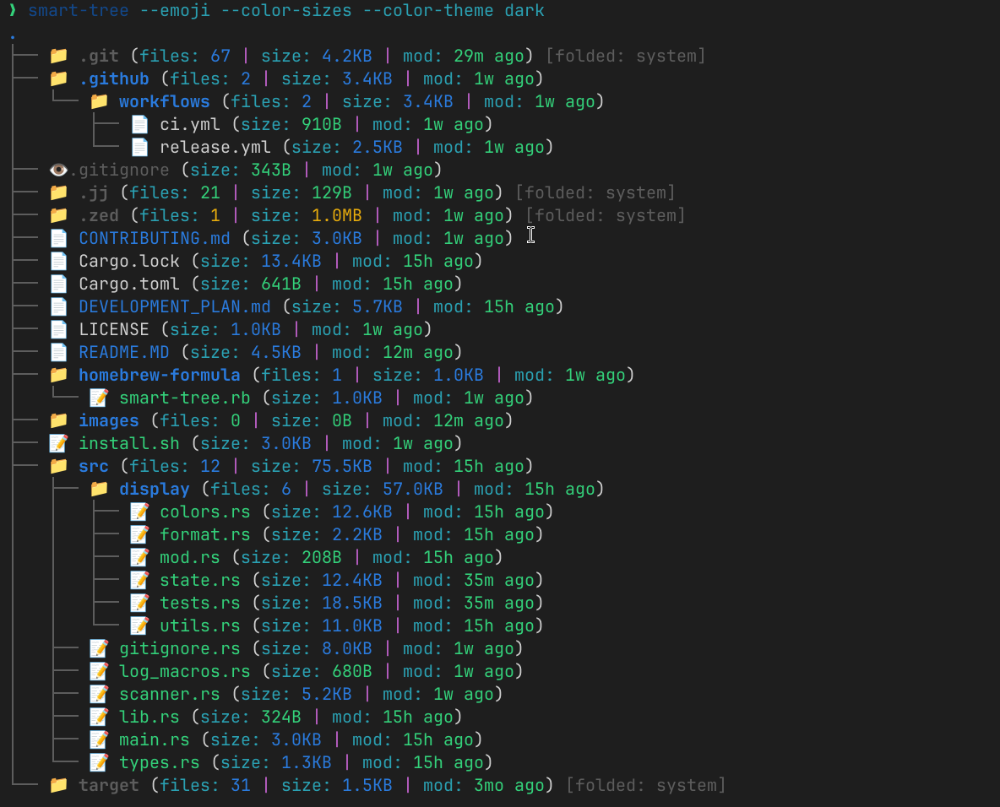

# Smart Tree 🌲

**A modern directory tree viewer that helps you instantly understand your file system.**

Smart Tree intelligently displays directories with automatic folding, rich metadata, and context preservation - showing you exactly what you need, when you need it.


*Add this screenshot to show Smart Tree with colors and emoji mode enabled*

## 🚀 Quick Install

```bash
# Linux/macOS - Install script
curl -sSL https://raw.githubusercontent.com/erik-balfe/smart-tree/master/install.sh | sh

# macOS - via Homebrew
brew install erik-balfe/tap/smart-tree

# From source
cargo install smart-tree
```

## ✨ Why Smart Tree?

Traditional tree commands show *everything* - leading to overwhelming, unusable output:

```
$ tree
.
├── node_modules/ (1,500+ files)
├── src/
├── dist/
├── .git/ (senseless files)
└── ... hundreds more lines
```

Smart Tree takes a more intelligent approach:

```
$ smart-tree
.
├── src/ (38 files, 1.2MB, modified 5m ago)
│   ├── components/ (15 files, 420KB)
│   │   ├── Button.js (modified 2m ago)
│   │   └── ... 3 more recent files
│   └── ... 5 more items
├── package.json (modified 1h ago)
├── node_modules/ (1.5k files, 250MB) [folded: system]
└── ... 3 more items
```

## 🔍 Key Features

- **Intelligent filtering** - Smart, context-aware decisions about what to show based on project type
- **Immediately spot what matters** - Recent changes and important files stand out
- **Project-aware** - Understands different project types (Rust, JavaScript, Python, etc.)
- **No visual clutter** - Automatically filters system directories like `.git` and `node_modules`
- **Smart rule system** - Uses context-aware rules to decide what to show and what to hide
- **Rich context** - File sizes, modification times, and directory statistics
- **Beautiful visualization** - Color-coded file types and emoji icons
- **Lightning fast** - Navigates even massive repositories with ease
- **Auto-adapts** - Works within your terminal's capacity while preserving critical information
- **Extensible** - Add your own custom filtering rules via configuration

## 💡 The Perfect Tool For...

### 1. Seeing Recent Changes at a Glance

```bash
$ smart-tree --sort-by modified --max-lines 10
```

Instantly see what's changed recently, perfect for quickly orienting yourself in a project or catching up after pulling changes.

### 2. Finding Large Files When Space is Tight

```bash
$ smart-tree --sort-by size
```

Spot disk space hogs immediately with rich size information and intelligent sorting.

### 3. AI Assistant Integration

Smart Tree's context-preserving output is ideal for AI assistants like GitHub Copilot or Claude. It provides rich context about project structure in a fraction of the tokens that traditional `tree` or `ls -R` would use.

```bash
# Get compact project context for your AI assistant
smart-tree --max-lines 25 --detailed
```

### 4. Smart Filtering for Different Project Types

```
$ smart-tree --list-rules
Available filtering rules:

  gitignore      - Files/directories matched by .gitignore patterns
  vcs            - Version control system directories (.git, .svn, .hg, .jj)
  build_output   - Build output directories (target, dist, build)
  dependencies   - Dependency directories (node_modules, venv)
  dev_environment - Development environment configs (.vscode, .idea)

Usage examples:

  --disable-rule vcs             # Show VCS directories
  --disable-rule dependencies    # Show dependency directories
  --show-hidden                  # Show all items that would be filtered
```

Smart Tree understands your project's context and automatically applies the most appropriate filtering rules for your specific language or framework:

```
$ smart-tree
.
├── .git (1 files, 1.0MB, modified just now) [folded: system]
├── .gitignore (13B, modified just now)
├── .vscode (1 files, 1.0MB, modified just now) [folded: system]
├── Cargo.toml (0B, modified just now)
├── README.md (0B, modified just now)
├── examples (1 files, 0B, modified just now)
│   └── demo.rs (0B, modified just now)
├── file1.bak (0B, modified just now) [[gitignored]]
├── src (2 files, 0B, modified just now)
│   ├── main.rs (0B, modified just now)
│   └── lib.rs (0B, modified just now)
└── target (10 files, 14B, modified just now) [folded: system]
```

The tool automatically:
- Detects Rust projects by `Cargo.toml` and filters `target/` as build output
- Respects `.gitignore` rules (notice `file1.bak` is marked as gitignored)
- Identifies and filters system directories like `.git` and `.vscode`

### 5. Repository Exploration

```bash
$ smart-tree --emoji --color-sizes --color-theme dark
```

Visually stunning display for exploring repositories with file type indicators, color-coded sizes and intuitive organization.

## 📊 Visual Examples

### Customized Display with Colors and Emoji

```bash
$ smart-tree --emoji --color-sizes --color-dates
```

*Add screenshot here showing beautiful colored output with emoji*

### Detailed View with Rich Metadata

```bash
$ smart-tree --detailed
```

*Add screenshot showing detailed metadata view*

## 🛠️ Usage

```bash
# Basic usage - current directory
smart-tree

# Specify directory
smart-tree /path/to/directory

# Control output size
smart-tree --max-lines 50

# Sort by modification time
smart-tree --sort-by modified

# Sort by size
smart-tree --sort-by size

# Limit directory depth
smart-tree -L 3

# Show system directories (like .git, node_modules, etc.)
smart-tree --show-system-dirs

# Show items that would normally be filtered out
smart-tree --show-hidden

# Customize filtering rules
smart-tree --disable-rule vcs --disable-rule build_output

# List all available rules
smart-tree --list-rules

# Show details about rule application
smart-tree --rule-debug

# Disable all rules completely
smart-tree --no-rules

# Show help with all options
smart-tree --help
```

## 📦 Installation Options

### Pre-built Binaries

Download pre-built binaries for your platform from the [GitHub Releases page](https://github.com/erik-balfe/smart-tree/releases).

### From Source

```bash
# Install from source
git clone https://github.com/erik-balfe/smart-tree.git
cd smart-tree
cargo install --path .

# Now you can run from anywhere
smart-tree [path] [options]
```

## 🤝 Contributing

We welcome contributions to Smart Tree! See [CONTRIBUTING.md](CONTRIBUTING.md) for detailed instructions.

## 📚 Design Philosophy

Smart Tree follows these key principles:

1. **Contextual Intelligence** - Understands your project's structure to show what's relevant in that context
2. **Information Density Over Completeness** - Shows relevant files while summarizing the rest  
3. **Context Preservation** - Maintains directory structure context even with strict line limits
4. **Smart Defaults with Configurability** - Works well out of the box but can be customized
5. **Rule-Based Filtering** - Uses an extensible system of rules to make informed display decisions

## 📋 Technical Details

See [DEVELOPMENT_PLAN.md](DEVELOPMENT_PLAN.md) for in-depth technical information about the project architecture, algorithms, and implementation details.
